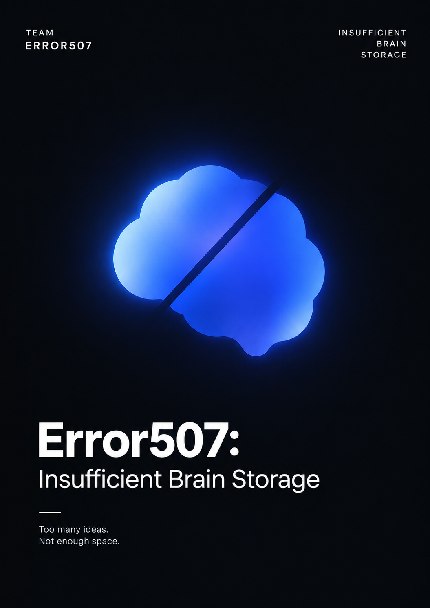

# Welcome to E26-AI01-07

## 🎯 팀 슬로건

> Error507: Insufficient Brain Storage

## 🖼️ 팀 포스터

***

## 1️⃣ 팀원 소개

| **이름**  | **전공** | **관심사**                   |
| ------- | ------ | ------------------------- |
| **서재민** | 인공지능전공 | 인공지능, 웹, 창업, 로봇, 돈        |
| **송채원** | 인공지능전공 | 인공지능, 보안, 암호              |
| **윤서후** | 인공지능전공 | 인공지능,게임,창업,기타             |
| **하준서** | 인공지능전공 | 인공지능, 디지털 헬스케어, 의료 데이터 분석 |

### 팀 소개

팀의 소개를 작성합니다.

***

## 2️⃣ 공통된 관심사 : 여행, 백엔드, 인공지능

***

## 3️⃣ 한학기 동안의 활동 내역

- 기관/부서 인터뷰 ✔️  

- 현장 탐방 ✔️  

- 멘토링 ✔️  
  - 내 지도 교수 함게 만나기
  - 대학원 방문 및 선배 만나기

- 프로젝트 진행 ✔️  
  - 과거에 사람들이 상상한 미래
  - 그들이 만들어가는 세상
  - 우리가 상상한 미래
  - 우리가 그리는 미래 그리고 나

- 각오와 소감 나누기 ✔️  

<!-- 활동 사진 추가 예시 -->

## 날짜별 활동 내역

<strong>📅 9월 18일</strong>

### 🟦 미션 1 — 이정문 화백이 예측한 미래와 현재 이루어진 것 4분류 및 근거 작성

#### 1. 실현됨

- **전기 자동차** — 전기차가 양산되어 실제 교통수단으로 널리 사용됨
- **태양광 발전 주택** — 주택용 태양광 발전 시스템이 상용화됨
- **소형 TV·전화기 — 스마트폰이 통화와 영상 시청 기능을 통합함**
- **전파 신문** — 스마트폰·태블릿을 통해 무선으로 실시간 뉴스를 이용할 수 있음
- **원격 학습** — 인터넷 강의와 화상 수업 등이 일반적으로 활용됨

#### 2. 일부 실현

- **스마트 부엌** — IoT 가전은 상용화됐지만 부엌 전체의 완전 자동화에는 한계가 있음
- **자율주행 자동차** — 제한된 환경에서 구현됐지만 완전자율주행의 일반 상용화에는 기술·안전·법·보험 등의 한계가 있음
- **원격 진료** — 실제 활용되고 있으나 직접 진찰의 한계와 제도·적용 범위의 제한이 존재함

#### 3. 아직 미실현

- **달나라 수학여행** — 달 여행이 일반인을 위한 관광·교육 수단으로 상용화되지 않았으며 비용·안전·기술적 장벽이 큼

#### 4. 방향 전환

- **움직이는 도로** — 도시 전체의 움직이는 도로 대신 공항·역 등의 무빙워크 형태로 유사한 기능이 구현됨

### 🟦 미션 2 — Why-What-How 심층 분석: 소형 TV·전화기

#### WHY

당시에는 정보를 얻거나 지인과 연락하기 위해 특정 장소에 있는 통신·영상 기기에 직접 가야 했기 때문에, 도구를 이용하는 것이 아니라 오히려 도구에 자신의 행동이 제약된다는 불편함이 있었을 것이다. 이러한 제약에서 벗어나 언제 어디서든 필요한 정보를 얻고 사람들과 소통하고자 하는 욕구에서 소형 TV와 전화기를 상상했을 것이다.

#### WHAT

정보와 소통의 공간적 제약이 사라진 모습을 상상했을 것이다. 장소에 관계없이 뉴스를 접하고, 원하는 TV 프로그램을 쉽게 시청하며, 언제든 지인들과 연락할 수 있는 일상을 꿈꿨을 것이다.

#### HOW

오늘날 그 상상은 단순히 소형화된 TV와 전화기를 넘어, 스마트폰이라는 하나의 기기에 뉴스·영상·통신 등 다양한 기능이 통합되는 형태로 구현되었다. 스마트폰은 이제 단순한 통신 도구를 넘어 일상생활에 필수적인 기기로 자리 잡았다.

#### NEXT

하지만 이러한 기술의 발전은 새로운 문제를 만들어냈다. 도구의 제약에서 벗어나기 위해 상상했던 스마트폰이 오히려 현대인에게 또 다른 형태의 제약이 된 것이다. 스마트폰에 지나치게 의존하거나 사용을 스스로 통제하기 어려운 문제가 나타나면서, 앞으로는 스마트폰과 어떻게 공존하고 적절하게 사용할 것인가가 새로운 과제가 되었다.

***

## 4️⃣ 인상 깊은 활동

- 활동명 – 활동에 대한 간단한 설명과 배운 점을 작성  
- 예: 멘토링에서 실리콘밸리 현업 경험을 들을 수 있어 진로 방향 설정에 큰 도움이 되었다.  

***

## 5️⃣ 특별히 알아보고 싶은 것
- 예: 현장실습 제도
- 예: 학부 졸업 인증 조건
- 예: 성취기반평가
- 예: 졸업 후 진로(대학원/취업)

***

## 6️⃣ 활동을 마친 소감

🔗학번 이름  
> "소감 내용을 여기에 작성합니다."

🔗학번 이름  
> "소감 내용을 여기에 작성합니다."

🔗학번 이름  
> "소감 내용을 여기에 작성합니다."

🔗학번 이름  
> "소감 내용을 여기에 작성합니다."

🔗학번 이름  
> "소감 내용을 여기에 작성합니다."

---
### Support or Contact

readme 파일 생성에 추가적인 도움이 필요하면 [도움말](https://help.github.com/articles/about-readmes/) 이나 [contact support](https://github.com/contact) 을 이용하세요.

