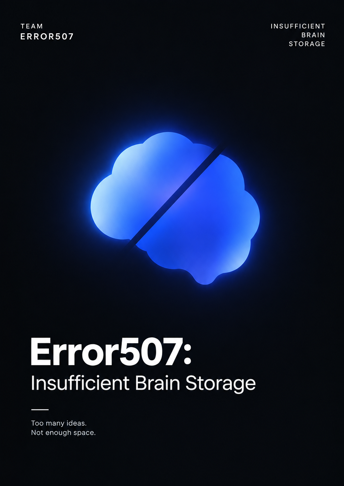

# Welcome to E26-AI01-07

## 🎯 팀 슬로건

> Error507: Insufficient Brain Storage

## 🖼️ 팀 포스터

***

## 1️⃣ 팀원 소개

| **이름**  | **전공** | **관심사**                   |
| ------- | ------ | ------------------------- |
| **서재민** | 인공지능전공 | 인공지능, 웹, 창업, 로봇, 돈        |
| **송채원** | 인공지능전공 | 인공지능, 보안, 암호              |
| **윤서후** | 인공지능전공 | 인공지능,게임,창업,기타             |
| **하준서** | 인공지능전공 | 인공지능, 디지털 헬스케어, 의료 데이터 분석 |

### 팀 소개

팀의 소개를 작성합니다.

***

## 2️⃣ 공통된 관심사 : 여행, 백엔드, 인공지능

***

## 3️⃣ 한학기 동안의 활동 내역

- 기관/부서 인터뷰 ✔️  

- 현장 탐방 ✔️  

- 멘토링 ✔️  
  - 내 지도 교수 함게 만나기
  - 대학원 방문 및 선배 만나기

- 프로젝트 진행 ✔️  
  - 과거에 사람들이 상상한 미래
  - 그들이 만들어가는 세상
  - 우리가 상상한 미래
  - 우리가 그리는 미래 그리고 나

- 각오와 소감 나누기 ✔️  

## 날짜별 활동 내역

<strong>📅 9월 18일</strong>

### 🟦 미션 1 — 이정문 화백이 예측한 미래와 현재 이루어진 것 4분류 및 근거 작성

#### 1. 실현됨

- **전기 자동차** — 전기차가 양산되어 실제 교통수단으로 널리 사용됨
- **태양광 발전 주택** — 주택용 태양광 발전 시스템이 상용화됨
- **소형 TV·전화기 — 스마트폰이 통화와 영상 시청 기능을 통합함**
- **전파 신문** — 스마트폰·태블릿을 통해 무선으로 실시간 뉴스를 이용할 수 있음
- **원격 학습** — 인터넷 강의와 화상 수업 등이 일반적으로 활용됨

#### 2. 일부 실현

- **스마트 부엌** — IoT 가전은 상용화됐지만 부엌 전체의 완전 자동화에는 한계가 있음
- **자율주행 자동차** — 제한된 환경에서 구현됐지만 완전자율주행의 일반 상용화에는 기술·안전·법·보험 등의 한계가 있음
- **원격 진료** — 실제 활용되고 있으나 직접 진찰의 한계와 제도·적용 범위의 제한이 존재함

#### 3. 아직 미실현

- **달나라 수학여행** — 달 여행이 일반인을 위한 관광·교육 수단으로 상용화되지 않았으며 비용·안전·기술적 장벽이 큼

#### 4. 방향 전환

- **움직이는 도로** — 도시 전체의 움직이는 도로 대신 공항·역 등의 무빙워크 형태로 유사한 기능이 구현됨

### 🟦 미션 2 — Why-What-How 심층 분석: 소형 TV·전화기

#### WHY

당시에는 정보를 얻거나 지인과 연락하기 위해 특정 장소에 있는 통신·영상 기기에 직접 가야 했기 때문에, 도구를 이용하는 것이 아니라 오히려 **도구에 자신의 행동이 제약된다는 불편함**을 느꼈을 것으로 보인다. 이러한 제약에서 벗어나 **언제 어디서든 필요한 정보를 얻고 사람들과 소통하고자 하는 욕구**가 **소형 TV와 전화기**에 대한 상상으로 이어졌다고 볼 수 있다.

#### WHAT

**정보와 소통의 공간적 제약이 사라진 모습**을 떠올렸을 것으로 보인다. 장소에 관계없이 **뉴스를 접하고, 원하는 TV 프로그램을 시청하며, 지인들과 연락할 수 있는 일상**을 기대한 것이다. 이러한 바람은 **작고 휴대할 수 있는 TV와 전화기**라는 구체적인 모습으로 나타났다.

#### HOW

오늘날 그 상상은 단순히 소형화된 TV와 전화기를 넘어, **스마트폰이라는 하나의 기기에 뉴스·영상·통신 등 다양한 기능이 통합되는 형태**로 구현되었다. 반도체와 디스플레이, 배터리의 소형화 및 성능 향상과 이동통신·무선 인터넷 기술의 발전이 **하드웨어 기반**을 마련했고, 모바일 운영체제와 애플리케이션, 스트리밍, 메신저 등의 **소프트웨어가 다양한 기능을 하나로 연결**했다. 과거의 상상에서는 소형 TV와 전화기가 각각 독립된 기기로 제시되었지만, 현재는 **스마트폰 한 대가 두 기기의 역할은 물론 정보 검색과 콘텐츠 제작·공유까지 수행**한다. 스마트폰은 이제 단순한 통신 도구를 넘어 일상생활에 필수적인 기기로 자리 잡았다.

#### NEXT

하지만 이러한 기술의 발전은 새로운 문제를 만들어냈다. 도구의 제약에서 벗어나기 위해 상상했던 스마트폰이 오히려 현대인에게 **또 다른 형태의 제약**이 된 것이다. **스마트폰에 지나치게 의존하거나 사용을 스스로 통제하기 어려운 문제**가 나타났으며, 개인정보 유출과 보안 위협, 알고리즘에 의한 정보 편향, 허위 정보의 확산, 디지털 격차도 새로운 **사회적·윤리적 과제**로 떠올랐다. 기술적으로도 **배터리 사용 시간과 재난 상황에서의 안정적인 연결성** 등 개선할 부분이 남아 있다. 앞으로는 스마트폰과 어떻게 공존하고 적절하게 사용할 것인지뿐만 아니라, 기술의 편리함과 **사용자의 권리·안전**을 어떻게 조화시킬 것인지도 함께 고민해야 한다.

<strong>📅 10월 2일</strong>

### 🟦 미션 1 — AI와 함께 문제 다시 쓰기

팀원이 대학생활에서 겪은 불편함을 각각 한 문장으로 적고, AI에게 "이 상황의 핵심 문제와 사용자 요구사항을 추상화해서 사용자, 상황, 문제, 기대 변화로 다시 정의해줘"라고 요청해 문제 정의문으로 바꿨다.

#### 문제 A. 포털 정보가 개인 일정에 반영되지 않는 문제

- **Before**: 학교 온라인 포털에 과제와 공지가 과목별로 흩어져 있어 직접 들어가 확인해야 하고, 마감일이 내 캘린더에 반영되지 않아 과제를 놓치기 쉽다.
- **After**: 수강생이 여러 과목의 과제와 공지를 확인할 때, 정보가 과목별 화면에 분산되어 있고 개인 일정과 연동되지 않아 마감을 놓치는 문제.
- 사용자는 한 학기에 6개 이상의 과목을 듣는 학생이고, 기대하는 변화는 마감일이 자동으로 일정에 들어와 포털을 매번 열지 않아도 되는 것이다.

#### 문제 B. 팀 프로젝트에서 모두가 비는 시간을 찾기 어려운 문제

- **Before**: 팀원 4명이 각자 시간표 캡처를 카카오톡에 올리고, 겹치는 공강을 눈으로 비교해서 찾는다.
- **After**: 팀 프로젝트 팀원이 회의 시간을 정할 때, 서로 다른 시간표를 수작업으로 대조해야 해서 시간이 오래 걸리고 겹치는 시간을 놓치는 문제.
- 기대하는 변화는 시간표를 입력하면 모든 팀원이 비는 시간대가 바로 나오는 것이다.

#### 문제 C. 학교 알림에 불필요한 정보가 많은 문제

- **Before**: 학교에서 오는 공지가 전체 학생 대상으로 발송되어, 내 학년·학과·관심사와 관계없는 알림이 많고 필요한 공지를 찾기 어렵다.
- **After**: 학생이 학교 공지를 확인할 때, 대상과 분야가 구분되지 않은 알림이 한꺼번에 오기 때문에 필요한 정보를 가려내는 데 시간이 들고 중요한 공지를 놓치는 문제.
- 기대하는 변화는 내 학과, 학년, 관심 분야에 해당하는 공지만 보는 것이다.

### 🟦 미션 2 — AI 아이디어 비교 및 선택

미션 1의 세 문제를 AI에게 각각 설명하고 해결 방향을 제안받은 뒤, 팀 기준으로 다시 평가했다.

| 평가 기준 | A. 포털 일정 통합 (선택) | B. 팀 공강 자동 계산 | C. 공지 맞춤 필터 |
| --- | --- | --- | --- |
| 필요성 (Why) | 과제를 놓치면 성적에 바로 영향이 있어 필요성이 크다 | 학기 내내 반복되지만 놓쳐도 손해가 크지 않다 | 매일 겪지만 직접적인 손해는 작다 |
| 새로움 (Novelty) | 시간표 앱과 캘린더 앱은 있으나 포털 과제와 연동한 서비스는 드물다 | 일정 조율 서비스가 이미 있다 | 키워드 필터는 일반적이다 |
| 실현 가능성 (How) | 포털의 공개 API 여부가 불명확하다. 복사·붙여넣기 입력이나 캘린더 파일(.ics) 내보내기로 시작할 수 있다 | 시간 구간의 교집합 계산이라 구현이 단순하다 | 규칙 기반 분류는 쉽지만 LLM 분류는 정확도 검증이 필요하다 |
| 위험 요소 (Risk) | 포털 계정 정보를 다루면 보안 문제가 생기고 약관 위반 가능성이 있다 | 시간표 공개에 대한 팀원 동의가 필요하다 | 중요한 공지가 필터에 걸러져 누락될 수 있다 |

#### AI의 반론과 팀의 수정

A에 대해 "작동하지 않거나 사용자가 외면할 이유 3가지"를 AI에게 요청했다.

1. 학교 포털이 외부 서비스 연동을 막아 두었을 수 있다.
2. 포털 로그인 정보를 맡기는 데 학생이 거부감을 느낀다.
3. 이미 쓰는 캘린더와 알림 앱이 있어서 새 서비스로 옮길 동기가 약하다.

1번과 2번에 대해서는 로그인 정보를 저장하지 않고, 사용자가 포털 내용을 직접 붙여 넣으면 마감일을 추출해 캘린더에 넣는 방식으로 시작하기로 했다. 3번은 새 앱을 만들지 않고 사용자가 쓰는 기존 캘린더에 일정을 넣는 방식으로 대응한다.

#### 최종 선택: A

- 과제 누락은 성적과 직접 연결되어 세 문제 중 피해가 가장 크다.
- C의 필터링은 A에서 "내 과목의 공지만 표시"하는 기능으로 포함할 수 있다.
- B는 구현이 가장 쉬워 이후 확장 기능으로 남긴다.
- 외부 포털 연동의 위험은 로그인 정보를 다루지 않는 입력 방식으로 낮춘다.

#### 사람이 결정한 부분과 AI가 도운 부분

- 사람이 결정한 부분: 불편함의 선정, 평가 기준, 최종 선택과 근거, AI 반론의 반영 방식
- AI가 도운 부분: 문제 정의문의 구조화, 해결 방향 초안, 실패 시나리오 제시

#### 다음 질문

붙여넣은 포털 텍스트에서 마감일과 과목명을 어느 정도 정확도로 추출할 수 있는가?

***

## 4️⃣ 인상 깊은 활동

- 활동명 – 활동에 대한 간단한 설명과 배운 점을 작성  
- 예: 멘토링에서 실리콘밸리 현업 경험을 들을 수 있어 진로 방향 설정에 큰 도움이 되었다.  

***

## 5️⃣ 특별히 알아보고 싶은 것
- 예: 현장실습 제도
- 예: 학부 졸업 인증 조건
- 예: 성취기반평가
- 예: 졸업 후 진로(대학원/취업)

***

## 6️⃣ 활동을 마친 소감

🔗학번 이름  
> "소감 내용을 여기에 작성합니다."

🔗학번 이름  
> "소감 내용을 여기에 작성합니다."

🔗학번 이름  
> "소감 내용을 여기에 작성합니다."

🔗학번 이름  
> "소감 내용을 여기에 작성합니다."

🔗학번 이름  
> "소감 내용을 여기에 작성합니다."

---
### Support or Contact

readme 파일 생성에 추가적인 도움이 필요하면 [도움말](https://help.github.com/articles/about-readmes/) 이나 [contact support](https://github.com/contact) 을 이용하세요.

